# RSS-Sentiment

## Filter RSS Feeds With Sentiment Analysis

#### Deployed App: [https://rss-sentiment.herokuapp.com](https://rss-sentiment.herokuapp.com)
#### Server Repository: [https://github.com/AaronGoldsmith1/rss-sentiment-server](https://github.com/AaronGoldsmith1/rss-sentiment-server)
#### Client Repository: [https://github.com/AaronGoldsmith1/rss-sentiment-client](https://github.com/AaronGoldsmith1/rss-sentiment-client)


### This project applies the  AFINN-165 wordlist to blocks of input text, and produces a numerical score based on the 'positive' or 'negative' quality of the text content.

### For example:
##### Analysis of the following string: 
`I love cats, but I am allergic to them.`

##### Produces the following results:

```
{
    score: 0.1111111111111111,
    calculation: [ { allergic: -2 }, { love: 3 } ],
    tokens: 9,
    positive: ['love'],
    negative: ['allergic']
}
``` 

##### Because the string has 9 tokens, the resulting comparative score looks like: `(3 + -2) / 9 = 0.111111111`

##### This score has a range of -1 to 1, so the RSS feed items will be classified based on the following distribution of comparative sentiment scores:

* Very Negative (-1 to -0.25)
* Slightly Negative (-0.25 to 0)
* Neutral (0)
* Slightly Positive (0 to 0.25)
* Very Positive (0.25 to 1)

##### The user will be able to filter the RSS feeds accoding to these Levels:

* 0 - Items with score -1 to 1 (All)
* 1 - Items with scores -0.25 to 1 
* 2 - Items with scores 0 to 1
* 3 - Items with scores .25 - 1

### Technologies Used
* MongoDB
* Express.js
* React.js
* Node.js
* Mongoose ODM
* Semantic-UI-React
* CanvasJS Charts
* Supertest
* Mocha
* Chai
* React Testing Libray
* Jest
* [rss-parser](https://www.npmjs.com/package/rss-parser)
* [sentiment](https://www.npmjs.com/package/sentiment)

### Screenshots

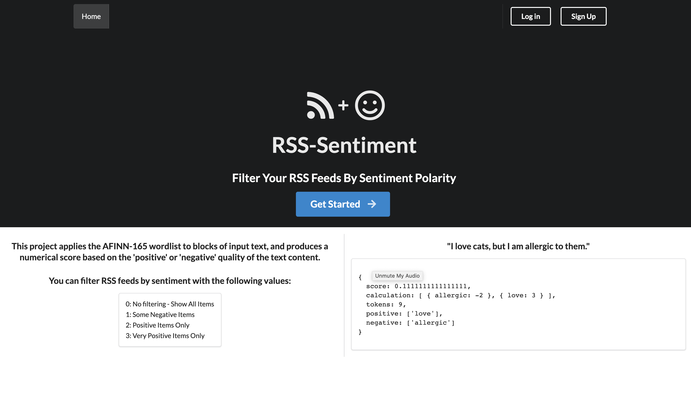
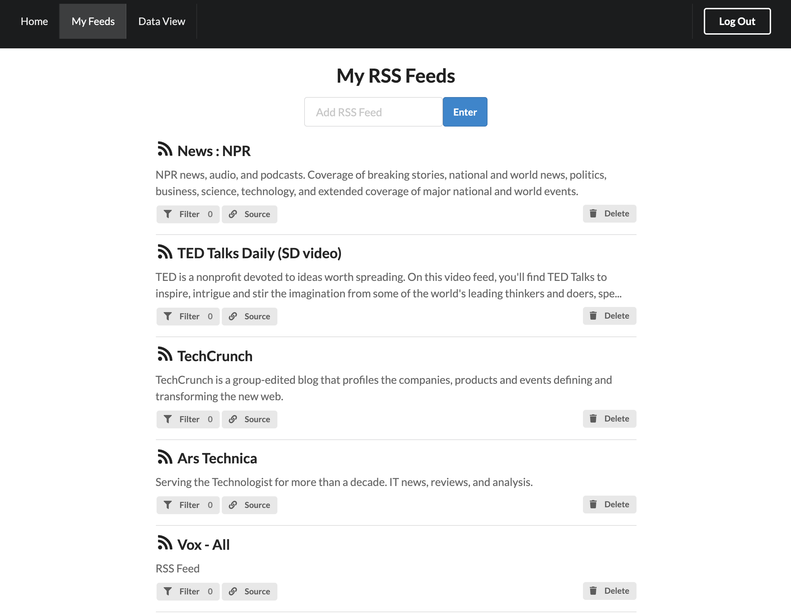
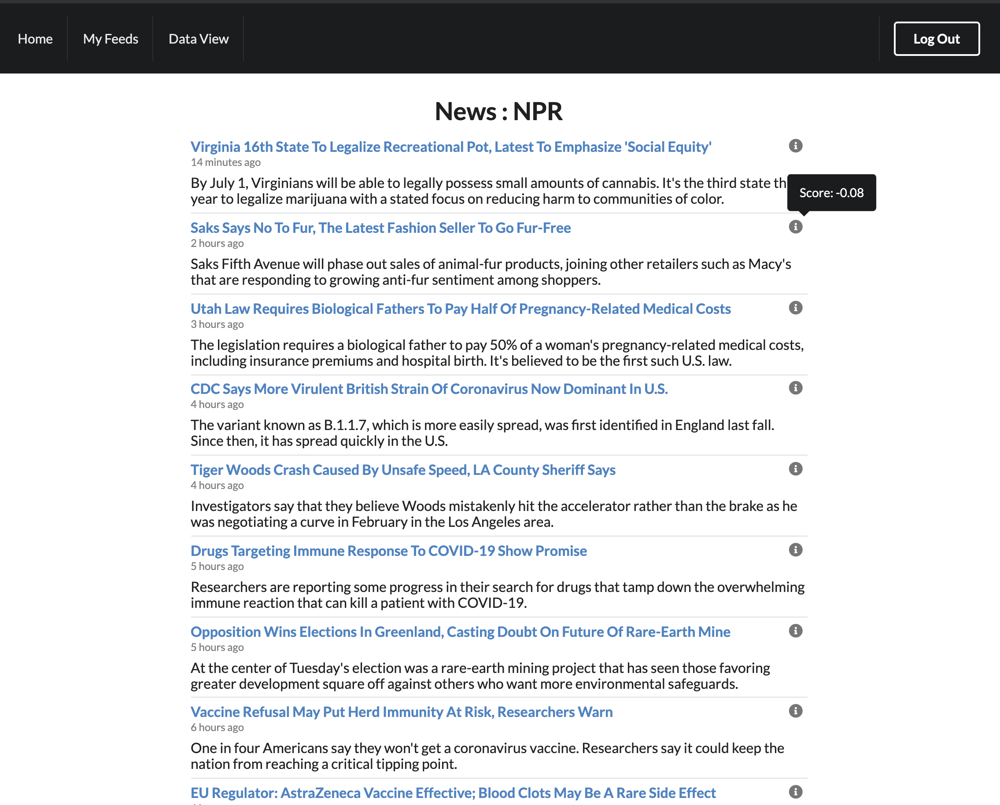
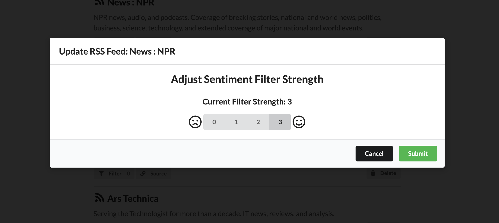
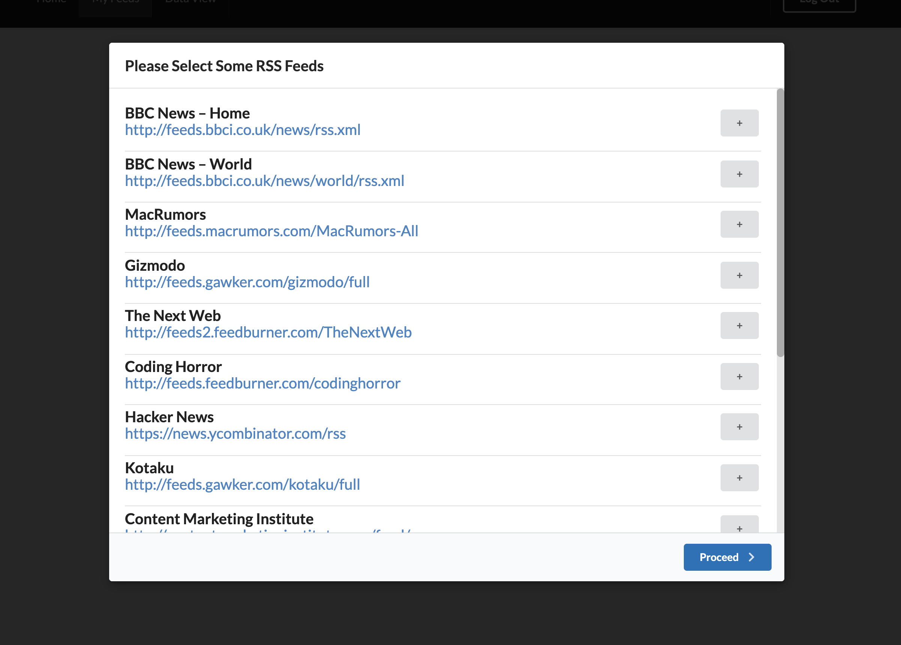
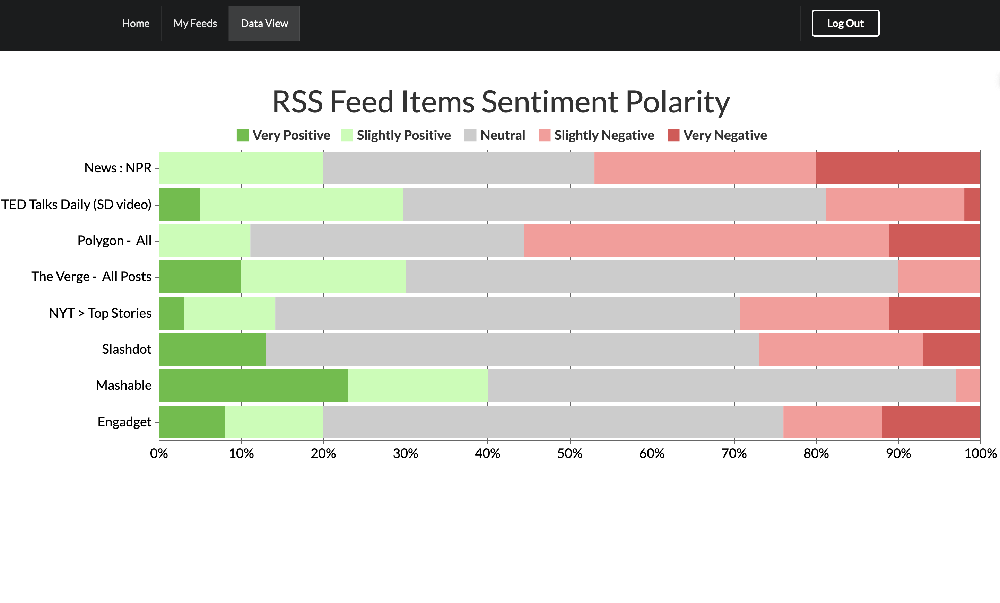

### Tests

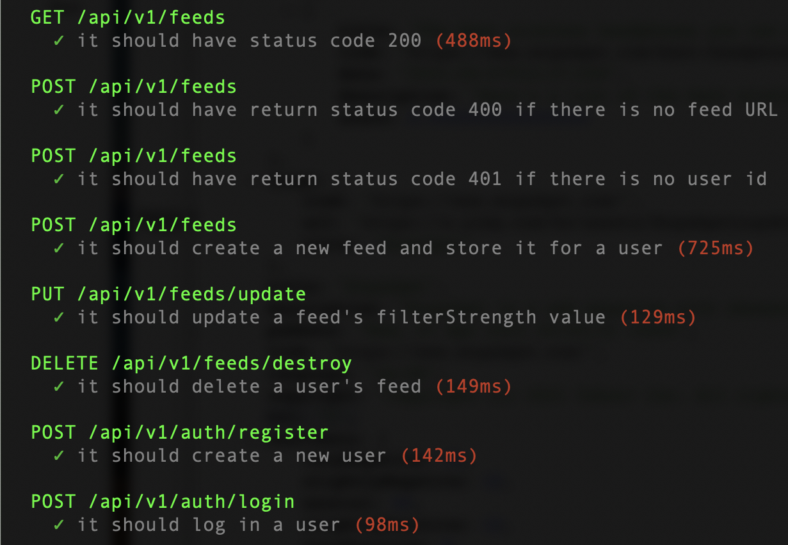

### ERD

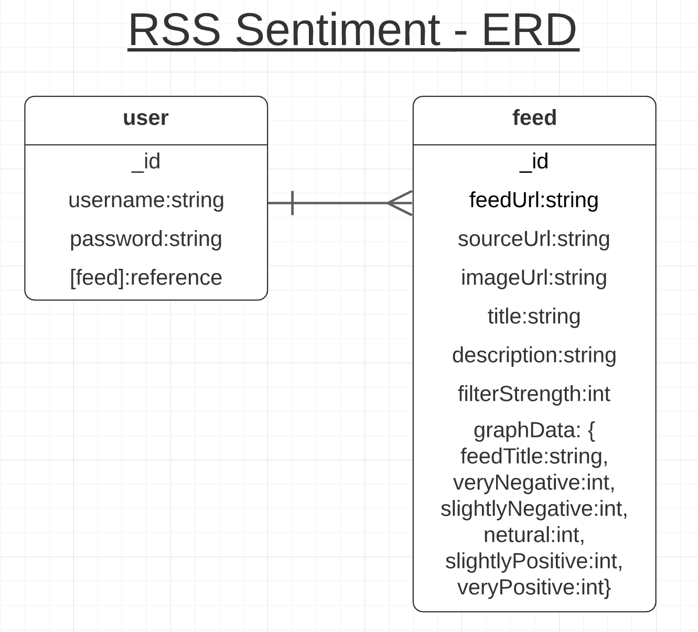

### Wireframes

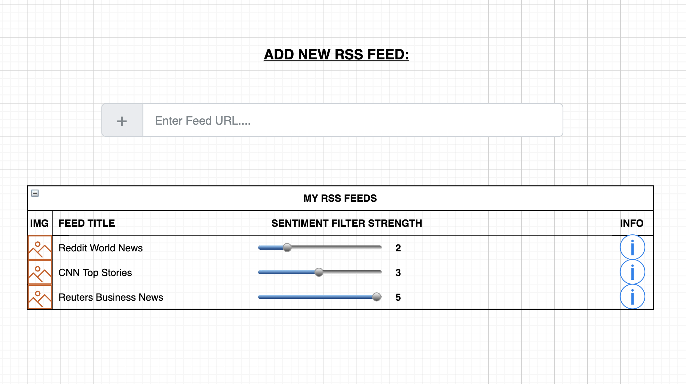
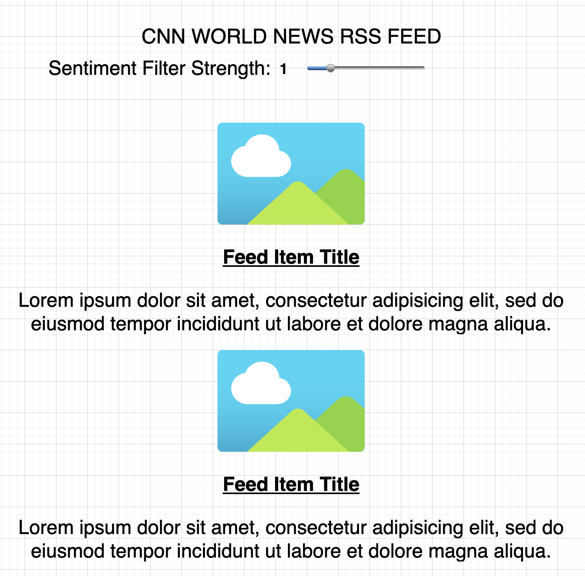
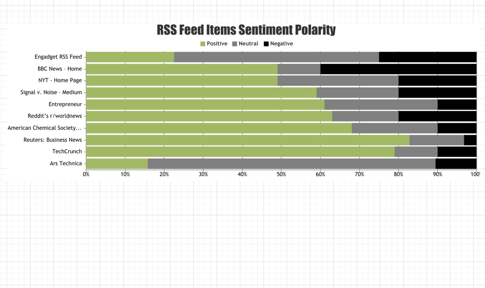


### Challenges / Considerations
* CanvasJS Bar Chart should be able to link to the specific feed for which the data is being displayed if a user clicks
* I'd like to add some form of user auth like JWTs or sessions
* Using a React state management solution like Redux or Recoil would help modularize front-end code and improve performance
* Further normalizing RSS feed data to accomodate feeds that include images and other data fields
* I'd like to include more front-end tests using React Testing Library
* I plan to refactor the React code to utilize hooks with functional components, and lifecycle methods to avoid page refreshes


### User Stories

* AAU, I want to be able to sign up and log in
* AAU, I want to add an RSS Feed to a list of feeds
* AAU, I want to see relevant information about an RSS feed after I add it to my list (image, title, link, etc.)
* AAU, I want to be able to view the content of an RSS feed, including images
* AAU, I want to be able to filter the content of my stored RSS feeds by sentiment, and have the filter setting persist to a database
* AAU, I would like to be notified with a message if there are no RSS feed items that meet the filter criterea
* AAU, I would like to see a feed item description by hovering over the item title
* AAU, I want to see a visualization of the distribution of sentiment scores for each feed in my list in a stacked bar chart
* (stretch) AAU, I would like to select an RSS feed from a predefined communal list of feeds and add it to my list
* (stretch) AAU, I would like to have the RSS feeds automatically fetch and display new content when it becomes available, without having to refresh the page


